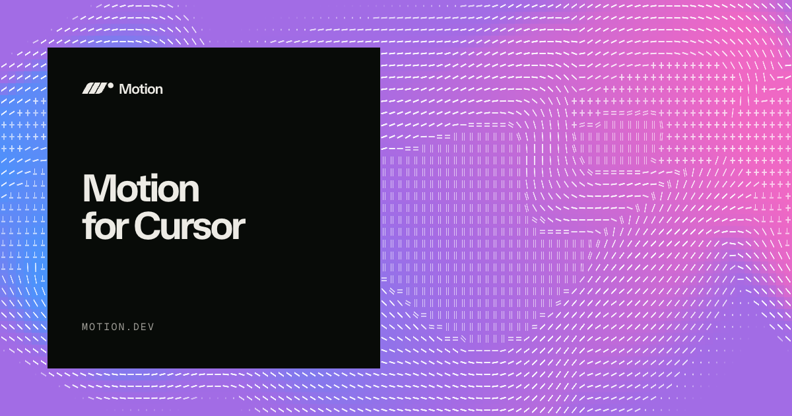

<p align="center">
  
</p>

# Motion AI Kit for Claude Code

Motion AI Kit for Claude Code is a suite of animation tools to help agents write production-grade animations.

## Features

**Animation best practices:** Hand-written advice by the creator of Motion for taste and technical best practices.

**The best Motion context:** The full and latest Motion documentation is made available for your agent to search. [Motion+](https://motion.dev/plus) members gain additional access to search the source code of 450+ Motion Examples and Motion UI components.

**CSS spring generation:** Use Motion to generate spring animations for CSS via the `linear()` easing.

**MotionScore performance audits:** Run static code and runtime analysis on a specific animation, component or page, graded by S to F, and fix with customised recommendations.

```
> /motion src/components for animation performance
```

```
Rank: B     S ████████████████░░░░░░░  9 · 45%
            A █████████░░░░░░░░░░░░░░  5 · 25%
            C ██████░░░░░░░░░░░░░░░░░  4 · 20%
            D ██░░░░░░░░░░░░░░░░░░░░░  2 · 10%

src/Sheet.tsx:34 — Tier D
What:     `height` transition on `.sheet-panel`
Why:      height triggers layout, then paint, then composite, every frame
Upgrade:  Motion's `layout` prop (B) or a `scaleY` transform (S)
```

## Install

```
/plugin marketplace add mjsarfatti/motion-claude-plugin
/plugin install motion@motion
```

That's it. Write `/motion` and ask to run audits, search docs and source code, and generate springs.

## Motion+

**[Motion+](https://motion.dev/plus)** adds the ability to search early access and Motion+ API documentation, plus source code for 450+ Motion Examples and Motion UI components. Plus, an experimental visual editor for tuning transitions against a live preview and then applying via your agent.

Ask Claude to sign you in and it hands you a link. Nothing gets pasted into
chat.

## Links

- [Motion](https://motion.dev)
- [Documentation](https://motion.dev/docs)
- [Examples](https://examples.motion.dev)
- [Motion UI](https://motion.dev/ui)
- [MotionScore](https://motion.dev/docs/motionscore)

---
